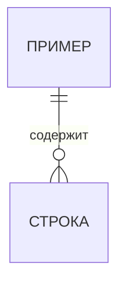

# Устройство: как сделано

**Статус:** черновик · **Дата:** · **Версия:** 1

## Стек

| Слой | Технология | Почему (решение) |
|---|---|---|
| Данные | | Р-… |
| Расчёты | | |
| Интерфейс | | |

## Три слоя

- **Данные** — где и как хранится.
- **Расчёты** — правила из [rules.md](rules.md). Проверяются отдельно от экранов.
- **Интерфейс** — экраны и отчёты. Проверяются сквозным (e2e) тестом.

## Модель данных

Смысл таблиц и неочевидных полей — простыми словами.

## Как проверяется

Что входит в `scripts/validate.py` для этого стека: тесты, e2e, прочее.

## Надёжность (если есть база данных)

- Связанные изменения — одной транзакцией («всё или ничего»).
- Главные правила — ограничениями в самой базе, где возможно.
- Миграции пронумерованы; применённую не правим; каждая — в транзакции, после бэкапа.
- Повторная загрузка данных не создаёт дублей.

## Известные ограничения и упрощения

- 
